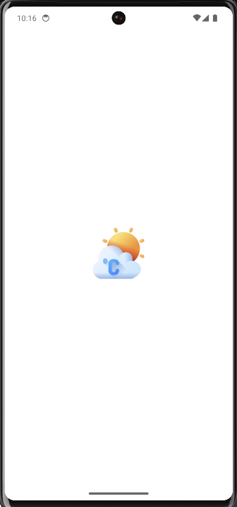
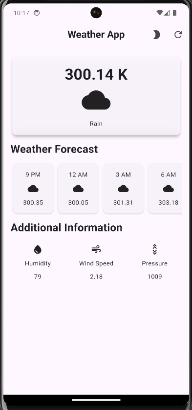
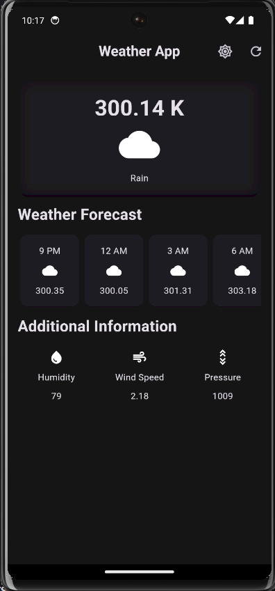

<h1 align="center" style="font-size: 18;"><strong><u>Weather App</u></strong></h1>
Weather App is a simple weather forcasting app build using flutter framework that displays the current weather and forecast for a given location.

  <strong>Splash Screen</strong> 
  

  <strong>UI</strong> 
  

  <strong>Dark Theme</strong> 
  

  <strong>Download the App</strong> 
  
   
  <em>Click the image above to download the live APK and try out our Weather App directly on your Android device!</em>

  <strong>Thank You!</strong> 
  Thank you for your interest in our Weather App. We hope it helps you stay prepared for whatever the weather brings. Stay safe and informed!

